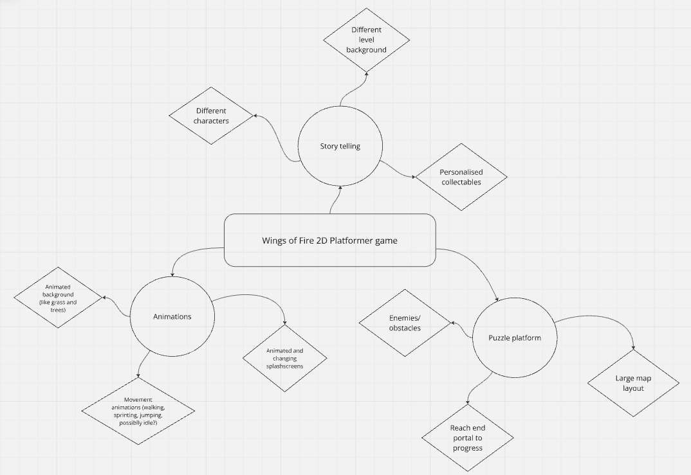

# __*Assesment Tast 1- UX Design*__ 
### By Vivian Ding

---

# **Project Proposal**

### <u>**1. Design brief**</u>
### **Provide an overview of your project, including the book you have chosen, the type of user experience you are creating (e.g., website, app, video game), and your target audience.**
\
My project is a video game based on the book series Wings of Fire, and is targeted towards young children to middle aged teenagers. It will be a 2D platformer game with multiple levels based on each book in the series. Wings of Fire is a series where each book is in a different character’s POV, so each level will be designed and planned based on what progressed in their book.

### <u>**2. Book choice and Justification**</u>
### **Identify the name of the book and author.**
### **Summarise what the book is about (like a blurb) - 1 paragraph or less.**
### **Explain why you chose this book and how it inspired your project.**
\
Since my game is based on the whole series rather than an individual book, I’ll just explain the whole series.

Wings of Fire is a series of high fantasy novels by Tui. T. Sutherland about dragons, where the series progresses through 3 arcs. The first arc is called the Dragonet Prophecy, where 5 dragonets are destined to save the world from the harsh war destroying each tribe. The second arch is The Jade Mountain Prophecy, where 5 dragonets have to save their school from destruction and death. The third and last arc is The Lost Continent, where a group of dragonets from another continent from the last two arcs are in trouble and have to find help to stop the evil forces that are trying to mind control everyone.

I love Wings of Fire because each book is so different, written specifically for the character POV it’s in. It’s so immersive and gives a lot of insight into the character’s thoughts and options in every book, really including us into their personality. 

The whole Wings of Fire series explores a lot of places, meets a lot of new characters and progresses through many plots. I really want to have a game where each level is inspired by each character, showing the story that they went through in their book. This not only reminds old readers of what happened, but encourages new readers as they travel through multiple levels.

### <u>**3. User experience type**</u>
### **Identify what format your project will take (Website, app, video game, interactive story, etc.).**
### **Explain how this format will enhance the story or themes of the book.**
\
The format of my project is a 2D platform video game made in Unity, and the aim of the game is to progress through each level of each different dragon throughout the series. I chose this format because the Wings of Fire series is so captivating that it would be hard to convey all the great points in an app or website in just words. Being able to play through the characters really shows the reader what they had to experience and achieve through their story and how it results in victory in the end.

### <u>**4. Target market**</u>
### **Identify the intended audience (Age group, interests, reading level, etc.).**
### **Explain why this project will appeal to them.**
### **Explain how your design choices will cater to this audience.**
\
The intended audience for Wings of Fire is young children to teenagers, and for those with an interest in high fantasy settings and characters. The reading level is from 8-11 year olds, but I’ve still been reading (listening) to the books almost everyday because of the incredible writing and character development. The foreshadowing and suspense is very well built, lore about the past is explained clearly, with lots of room to imagine things for yourself. 

My project will appeal to them through the design choices of a small pixelated world with different settings related to the characters. It’s in a simple and cute art style that suits the reading level, as a realistic 3D game is both unfitting and graphic.

### <u>**5. Software and Tools**</u>
### **List the software, platforms, and tools you plan to use (e.g., Adobe XD, Unity, HTML/CSS, video editing software).**
### **Explain why each of the above are suitable for your project.**
\
I will use Unity to create my project as it is a video game, fitting in the adventure and fantasy aspect of the book series. It is easily customisable to fit the theme and can resonate with the users well.

### <u>**6. Initial Brainstorming**</u>
### **Create a three-tiered mind map to outline your ideas.**
### **Identify key themes, design elements, and user interactions relevant to your project.**
### **Evaluate each branch by considering its feasibility, impact, and effectiveness before making design decisions.**
\

\
The key themes of my game it’s its immersive environmental settings, as each level is designed and based on each novel in the series. It focuses on each character’s journey through their stories, which is why it is very peaceful compared to other 2D platformer games. The aim of the game is just to travel through each character’s level to the end, reflecting on the challenges that have happened throughout the books.

I do think that this project will take a few weeks to do, mainly each level uses different elements and backgrounds, but I do believe that this is feasible. I hope that the hard work I put into this project will create a good result and effectively engage players into it.

# **Requirements Outline**
### Functional Requirements
* Usability
